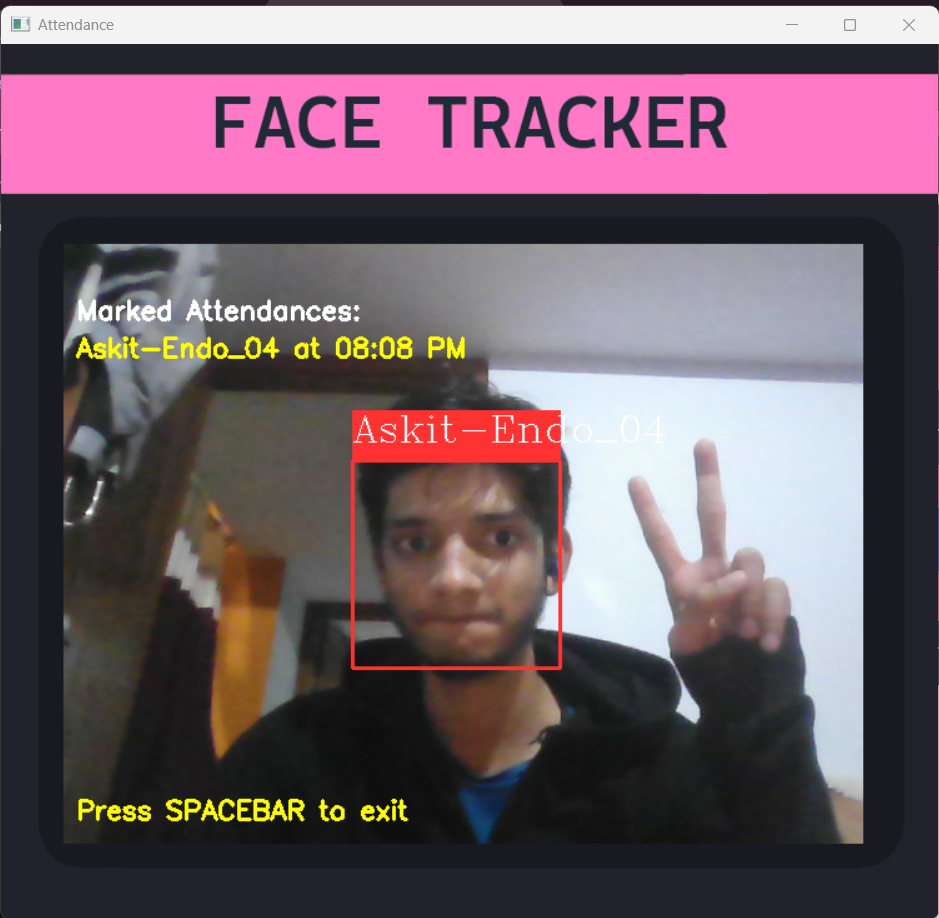

# 📸👤 Face Recognition Attendance System

A web-based attendance system that uses face recognition to make attendance fun, fast, and foolproof! Built with 🐍 Flask and 📻 OpenCV, it’s time to wave goodbye to manual registers and say hello to the future. 🌌

<div align="center">


</div>

## 🎯 Features

- 🔍 **Real-time Face Detection & Recognition** – Smile, you're on camera!
- 🥇 **User-Friendly Registration** – Add new users effortlessly with live face capture.
- ⏳ **Automatic Attendance Marking** – No more roll calls.
- 🕮️ **Glass Morphism UI** – It’s not just smart; it’s pretty.
- 🌄 **Real-Time Updates** – See attendance as it happens.
- 📄 **CSV-Based Records** – Attendance data you can trust.
- ⌚ **AM/PM Time Format** – Because we like to keep it classic.
- 🔄 **Responsive Design** – Looks good on any device.

## 🔧 Tech Stack

| **Component**           | **Technology**                  |
| ----------------------- | ------------------------------- |
| 🔧 **Backend**          | Python, Flask                   |
| 🕵️ **Computer Vision**  | OpenCV, Haar Cascade Classifier |
| 🧠 **Machine Learning** | scikit-learn (KNN Classifier)   |
| 🎨 **Frontend**         | HTML, CSS, JavaScript           |
| 📊 **Data Handling**    | Pandas, NumPy                   |
| 🛠 **Model Storage**     | joblib                          |

## 🔧 Prerequisites

- Python 3.8 or higher 🤠
- A webcam 📼
- A modern web browser (preferably Chrome/Firefox) 🌐

## 📖 Installation

1. **Clone the repository**:

```bash
git clone https://github.com/AskitEndo/Face-Attendence-python
cd face_recognition_flask
```

2. **Create and activate a virtual environment**:

```bash
python -m venv .venv

# On Windows
.\.venv\Scripts\Activate.ps1

# On Linux/Mac
source .venv/bin/activate
```

3. **Install dependencies**:

```bash
pip install -r requirements.txt
```

## 🆙 Usage

1. **Start the application**:

```bash
python app.py

```

or

```bash
#for direct run

.\venv\Scripts\activate.ps1 && cd face_recognition_flask && python app.py
```

2. **Open your browser** and navigate to:

```
http://127.0.0.1:5000
```

3. **Add a new user**:

   - Click on **Add New User**.
   - Enter the user’s name and ID.
   - Look at the camera – say cheese! 😎
   - The system will capture 10 images of your face.

#### The face recognition model (`face_recognition_model.pkl`) will be automatically created after the first user registration. This model file is essential for face recognition and will be updated each time a new user is added.

4. **Mark attendance**:
   - Click **Take Attendance**.
   - Look into the camera 🔍.
   - Press `SPACEBAR` to exit.

## 🔬 Project Structure

```
face_recognition_flask/
├── app.py                           # Main application file
├── requirements.txt                 # Python dependencies
├── haarcascade_frontalface_default.xml  # Face detection model
├── templates/
│   └── home.html                    # HTML template
├── static/
│   ├── faces/                       # User face images
│   └── face_recognition_model.pkl   # Trained model
└── Attendance/                      # Daily attendance records
```

## 🙌 Why You’ll Love It

- **No more forgetting to mark attendance.** Your face does the work for you!
- **Beautiful UI.** Even attendance can be aesthetically pleasing. 💃
- **Easy to use.** No steep learning curve.
- **Great for schools, offices, or hackathons.**

## App Demo Live 👤🙂‍↕️

<div align="center">

</div>

## 🌍 Contributing

Want to make this system even cooler? Follow these steps:

1. Fork the repository 🌐.
2. Create your feature branch:

```bash
git checkout -b feature/AmazingFeature
```

3. Commit your changes:

```bash
git commit -m 'Add some AmazingFeature'
```

4. Push to the branch:

```bash
git push origin feature/AmazingFeature
```

5. Open a Pull Request 🌟.

## 👨‍💻 Author

Crafted with 💻 and ☕ by **AskitEndo**. Love building cool stuff and sharing knowledge! Found this helpful? Drop a 🌟 or buy me a coffee! Let's inspire, not plagiarize. 😉

## 🔒 License

This project is licensed under the MIT License. See the LICENSE file for details.
